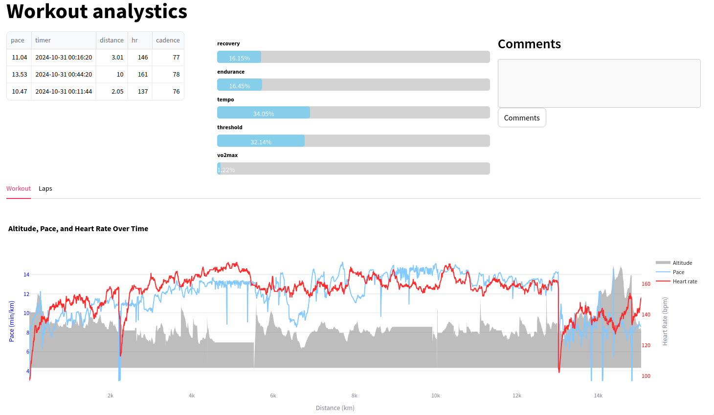

# Workout Analytics Platform

An all-in-one solution for analyzing swim, bike, and run workouts with performance insights, personalized workout planning, and metrics tracking.

---

## Features

### Calendar View
- **Activity Overview:** View all completed and planned workouts in one place.
- **Detailed Activity Metrics:** Click on activities to see an in-depth look at workout details, including planned workouts with pacing goals.  


### Analytics
- **Workout Details:** View detailed metrics for each workout, including metrics per lap and time spent in training zones.
- **Graphs:** Visualize pace and heart rate trends, as well as lap-based average pace.


### Workout Planner
- **Custom Workouts:** Create workouts with configurable warm-up, cooldown, and intervals. Each workout must include a warm-up and cooldown, and users can add sets with active and rest periods.
- **Export for Garmin:** After creating a workout, download it for use with a Garmin watch (requires connecting the watch to a computer for upload).


### View Plan
- **Planned Workout Details:** Click on a planned workout in the calendar to see pacing or power targets per lap.


### Upload
- **Upload Activities:** Upload a `.fit` file to log a workout, which will then appear in the calendar and update home page metrics.

### Threshold Update
- **Set Training Thresholds:** Set thresholds to personalize training zones, which are then used for future calculations. Update thresholds at any time to keep metrics aligned with current fitness levels.

---

## Roadmap

Here’s the current roadmap for the project:

- [ ] **Q4 2024** - Initial Release
  - [x] Fix issues with planned workouts for cycling (support multiple sets)
  - [x] Enable activity rating and feedback based on RPE (Rate of Perceived Exertion)
  - [x] Complete CI/CD pipeline setup
  - [ ] Fixing known bugs.

- [ ] **Q1 2025** - Workout Generation and Improvements
  - [ ] Generate a workout based on past activities.
  - [ ] Migrate endpoint to GO server.
  - [ ] Implement load balancer
  - [ ] Track intra-workout calorie consumption
  - [ ] Improve overall user experience (UX)

- [ ] **2025** - Switching front framework.

---

# Key Metrics

### Training Stress Score (TSS)

**TSS** quantifies the training load of a workout based on its intensity and duration.

**Formula**:

```math
\text{TSS} = \frac{\text{Duration} \times \text{IF}^2 \times 100}{\text{FTP}}
```


- **Duration**: The time spent on the workout in minutes.
- **IF (Intensity Factor)**: The ratio of the normalized power (or pace) to the athlete’s functional threshold power (FTP) or pace.
- **FTP (Functional Threshold Power)**: The highest power output (or pace) that an athlete can maintain in a quasi-steady state for approximately 1 hour.

### Chronic Training Load (CTL)

**CTL** represents the long-term training load, often referred to as "fitness." It is calculated as the exponentially weighted moving average (EWMA) of TSS over a 42-day period.

**Formula**:

```math
\text{CTL}_\text{today} = \text{CTL}_\text{yesterday} + \frac{\text{TSS}_\text{today} - \text{CTL}_\text{yesterday}}{42}
```


### Acute Training Load (ATL)

**ATL** represents the short-term training load, often referred to as "fatigue." It is calculated as the exponentially weighted moving average of TSS over a 7-day period.

**Formula**:

```math
\text{ATL}_\text{today} = \text{ATL}_\text{yesterday} + \frac{\text{TSS}_\text{today} - \text{ATL}_\text{yesterday}}{7}
```

### Training Stress Balance (TSB)

**TSB** is the difference between CTL and ATL, often referred to as "form." It indicates an athlete's readiness to perform.

**Formula**:

```math
\text{TSB} = \text{CTL} - \text{ATL}
```

